```mermaid
gitGraph
   commit id: "init"
   branch main
   checkout main
   commit id: "prod-ready N"
   commit id: "ongoing dev"

   branch feature-ABC-123
   checkout feature-ABC-123
   commit id: "work"
   commit id: "complete"

   checkout main
   branch release-1.0.x
   commit id: "stabilize"
   checkout release-1.0.x
   merge feature-ABC-123
   commit id: "rc-merge" tag: "rc-1"

   commit id: "RC builds"
   commit id: "v1.0.0" tag: "v1.0.0"

   checkout main
   merge release-1.0.x

   branch hotfix-1.0.1
   commit id: "hotfix change"
   
   checkout release-1.0.x
   merge hotfix-1.0.1
   commit id: "v1.0.1" tag: "v1.0.1"
   
   checkout main
   merge hotfix-1.0.1

   checkout main
   branch release-1.1.x
   commit id: "stabilize next"
```

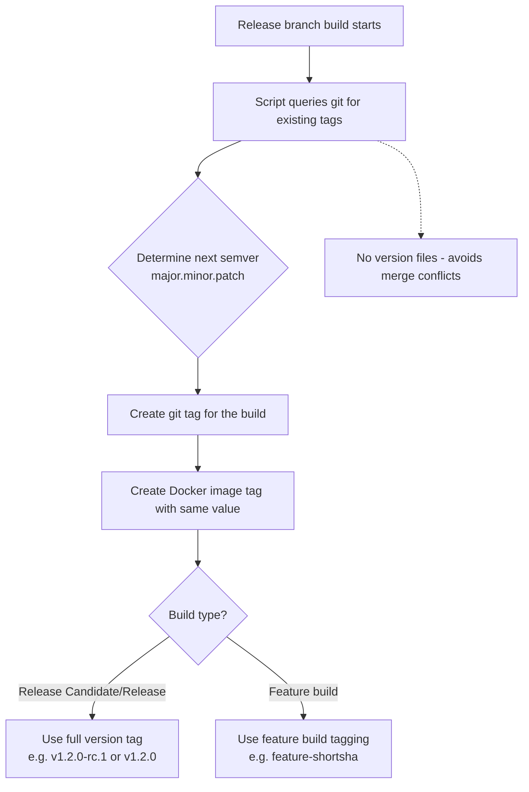

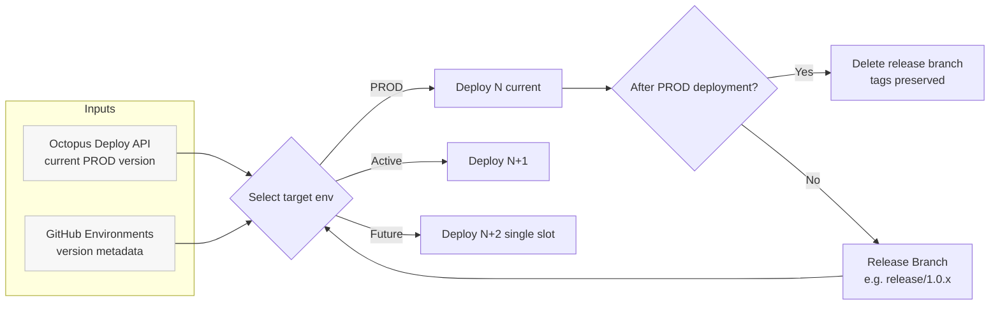

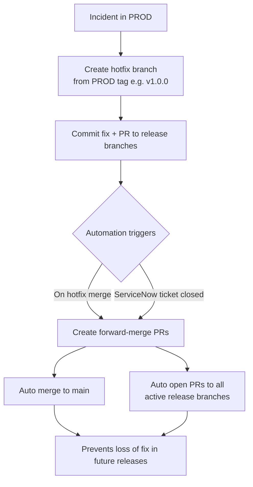

## Alternative Chart Types

### Timeline Chart
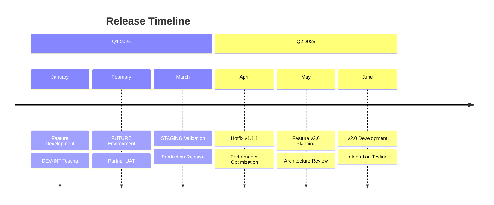

### Gantt Chart
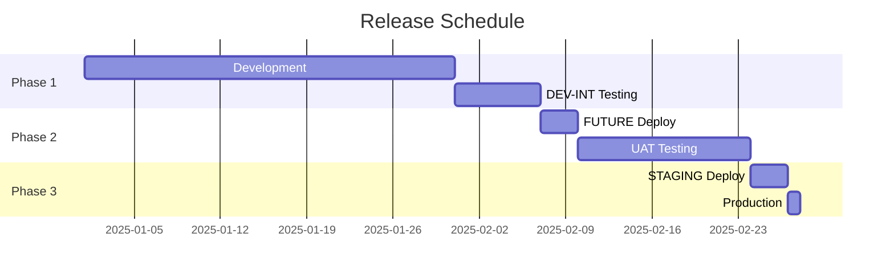

### Pie Chart
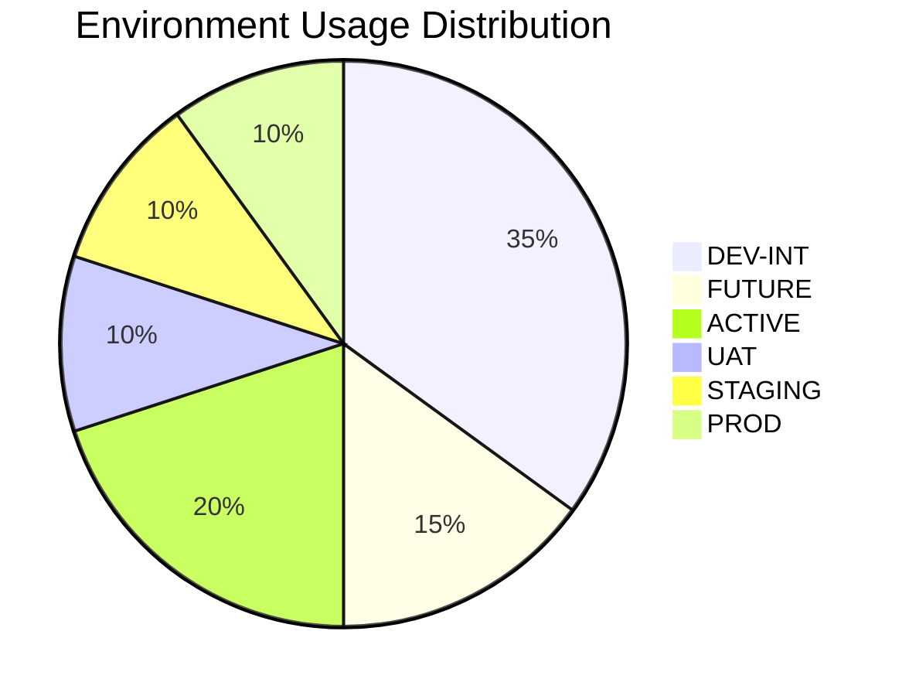

### Mindmap
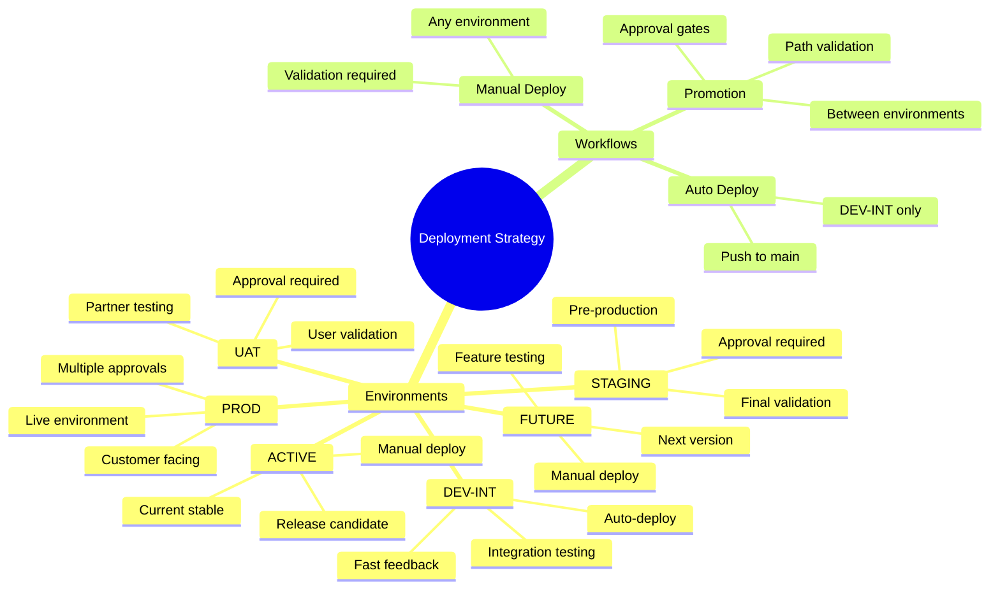

### State Diagram
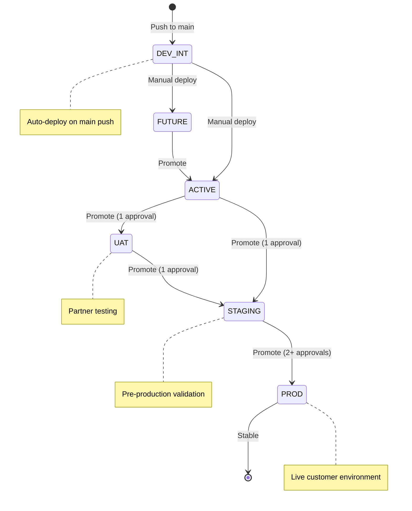

### Class Diagram
```mermaid
classDiagram
    class Environment {
        +String name
        +String branch
        +Boolean autoDeploy
        +Int approvalRequired
        +String purpose
        +deploy()
        +validate()
    }
    
    class Workflow {
        +String type
        +String trigger
        +List~Job~ jobs
        +run()
        +validate()
    }
    
    class Job {
        +String name
        +String runner
        +List~Step~ steps
        +String condition
        +execute()
    }
    
    class Step {
        +String name
        +String action
        +Map inputs
        +Map outputs
        +run()
    }
    
    class Promotion {
        +String sourceEnv
        +String targetEnv
        +String releaseId
        +Boolean approved
        +promote()
        +validate()
    }
    
    Environment ||--o{ Workflow : contains
    Workflow ||--o{ Job : executes
    Job ||--o{ Step : runs
    Environment ||--o{ Promotion : participates
```

### User Journey Map
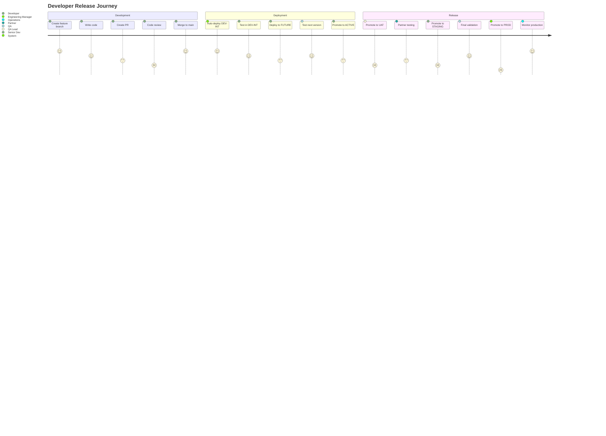

### Git Graph (Alternative Style)
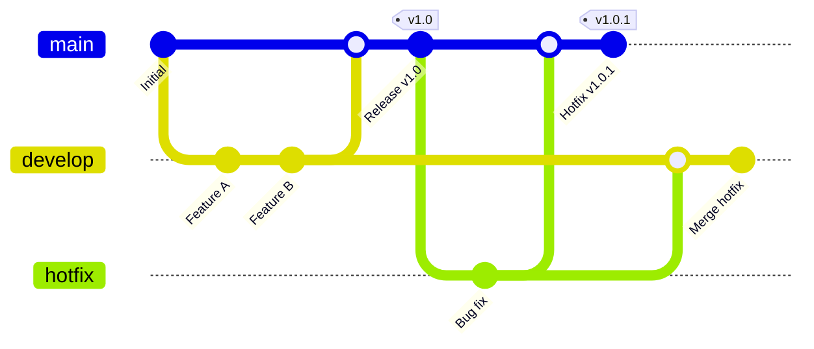

### Sequence Diagram
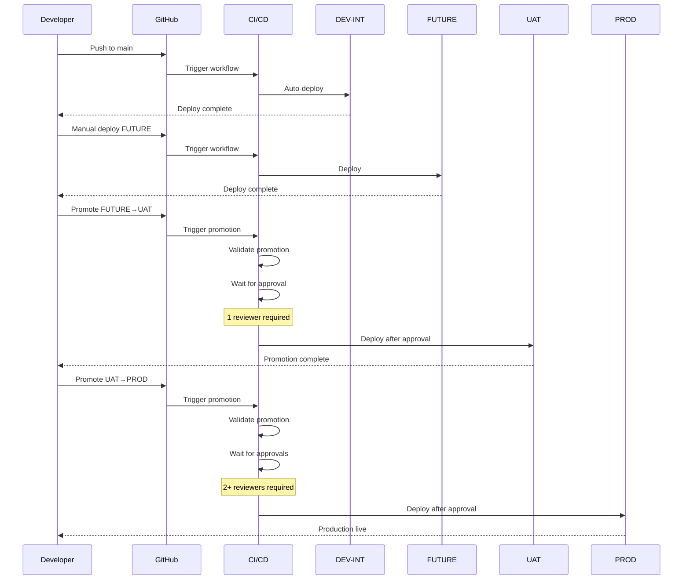

### ER Diagram (Entity Relationship)
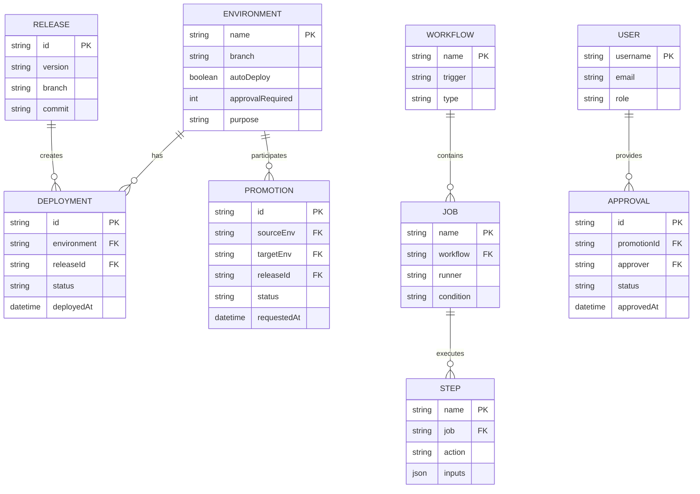

### Sankey Diagram
```mermaid
sankey-beta
    %%{wrap}%%
    DEV-INT,ACTIVE,100
    DEV-INT,FUTURE,50
    FUTURE,ACTIVE,40
    ACTIVE,UAT,60
    ACTIVE,STAGING,30
    UAT,STAGING,50
    STAGING,PROD,80